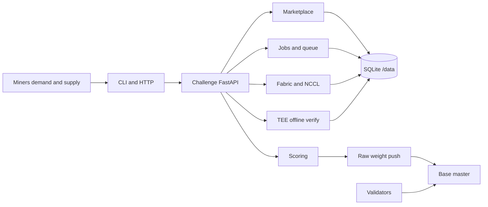

<div align="center">

# Hypercluster

**Base Intelligence compute power challenge: miners supply cluster capacity and demand multi-node jobs through a home-grown marketplace.**

<a href="docs/miner/README.md">Miners</a> ·
<a href="docs/provider/README.md">Providers</a> ·
<a href="docs/architecture.md">Architecture</a> ·
<a href="docs/cli.md">CLI</a> ·
<a href="docs/security.md">Security</a>

[](LICENSE)
[](pyproject.toml)
[](https://github.com/BaseIntelligence/base)

</div>

---

## Overview

Hypercluster is a [Base Intelligence](https://github.com/BaseIntelligence/base) challenge service. Miners can **supply** GPU/CPU capacity (register nodes, list offers, host pods) and **demand** Modal-like multi-node jobs (browse offers, rent, submit work). The challenge owns marketplace lifecycle, topology-aware InfiniBand/NCCL planning (local simulator in default CI), optional dstack TEE offline verification, and a four-factor scoring engine that emits **raw hotkey weights** to Base master.

Hypercluster scores marketplace honesty and execution quality. It is **not** a commercial cloud broker and **does not ship** a Verda (or other cloud) product adapter. You do **not** need a commercial GPU broker account to mine. Self-owned SSH fleets and inventory registered through the home-grown APIs are the product path. Multi-node fabric validation defaults to a deterministic local simulator; live single-GPU ops checks are optional maintainer tooling outside the product package tree.

Trust model: **cryptographically-anchored trust-but-audit**. Signed miner/provider writes, digest-pinned jobs, fabric gates, optional TEE multipliers, integrity zeros on spoof paths. Multi-node InfiniBand is not an encrypted confidentiality fabric under GPU CC/TDX; TEE bolsters collocated honest compute, not wire secrecy across ranks.

## Architecture



## How it works

1. Challenge API exposes Base identity surfaces (`/health`, `/ready`, `/version`) plus public `/v1/*` marketplace, jobs, scoring, and local-sim hooks.
2. Providers register hotkeys and nodes, emit fabric reports, and list offers with hard price and lifetime guards.
3. Demand miners rent listed capacity (lease + pod) and submit HyperJobs with world size, fabric mode, and TEE mode.
4. Planner builds a topology-aware rankmap and NCCL env; launcher/collector path runs under combined worker or separate drain loops.
5. Attempts produce correctness, efficiency, fabric_gate, and tee_bonus factors; composite scores aggregate per hotkey.
6. Weight snapshots push raw non-negative hotkey floats to Base master (never `set_weights` from the challenge).
7. Local `hypercluster sim` scenarios cover smoke, marketplace, NCCL multi-node, TEE offline, and weights without live cloud spend.

## Roles

| Role | Duties |
| --- | --- |
| **Demand miner** | Browse offers, rent capacity, submit jobs, cancel, inspect attempts and scores |
| **Provider (supply miner)** | Register nodes, heartbeat, fabric-scan, list/withdraw offers, host pods |
| **Operator / maintainer** | Run API + SQLite `/data`, combined worker knobs, sim doctor, weight push to master |
| **Validator** | Fetches aggregated weights from Base; does not write challenge DB |

Same hotkey may act as demand and supply; self-deal soft penalties apply in scoring aggregation.

## Documentation

| Audience | Guide | Contents |
| --- | --- | --- |
| Everyone | [Architecture](docs/architecture.md) | Components, data model, trust boundaries |
| Demand miners | [Miner guide](docs/miner/README.md) | Rent, submit jobs, score visibility |
| Providers | [Provider guide](docs/provider/README.md) | Nodes, offers, heartbeats, fabric |
| Operators | [Marketplace](docs/marketplace.md) | Offers, leases, pods, guards |
| Operators | [Jobs](docs/jobs.md) | Lifecycle, queue, results |
| Operators | [Fabric sim](docs/fabric.md) | Topology, NCCL, honesty layers |
| Operators | [TEE offline](docs/tee.md) | Fixtures, compose-hash, TEE bonus |
| Operators | [Scoring](docs/scoring.md) | Four-factor formula, weights |
| Operators | [CLI](docs/cli.md) | Full Typer surface |
| Maintainers | [Live QA protocol](docs/live-qa.md) | External single-GPU ops only |
| Everyone | [Security](docs/security.md) | Secrets, residual risks, isolation |

## Run locally

Requires Python ≥ 3.12 and [uv](https://github.com/astral-sh/uv).

```bash
uv sync --all-extras

# Dev API (default local bind 3200; container uses 8000)
export CHALLENGE_SHARED_TOKEN=dev-token
export CHALLENGE_DATABASE_URL=sqlite+aiosqlite:////tmp/hypercluster-dev/challenge.sqlite3
mkdir -p /tmp/hypercluster-dev
uv run hypercluster serve --host 127.0.0.1 --port 3200

# Identity probes
curl -fsS http://127.0.0.1:3200/health
curl -fsS http://127.0.0.1:3200/ready
curl -fsS http://127.0.0.1:3200/version
uv run hypercluster health --url http://127.0.0.1:3200
```

Docker (challenge-only compose; host map `3250 → 8000`):

```bash
# Stage Base SDK wheel when building offline, then:
docker compose up --build
curl -fsS http://127.0.0.1:3250/health
```

Copy `.env.example` for `CHALLENGE_*` / `HYPER_*` knobs. Never commit tokens.

## Validation quick reference

Default gates are local only (unit, integration, sim). They never auto-load commercial cloud credentials.

```bash
uv run ruff check .
uv run mypy
uv run pytest -q
uv run hypercluster sim doctor --offline
uv run hypercluster sim run-scenario --name smoke --url http://127.0.0.1:3200
```

Canonical sim scenario order: `smoke` → `marketplace` → `nccl` → `tee-offline` → `weights`.

## Repository layout

```text
src/hypercluster/     # FastAPI app, domain, fabric, attest, scoring, CLI, sim
tests/                # unit, API, CLI, fabric, attest, docker (serial)
scripts/qa/           # external maintainer-only live ops helpers (not product adapters)
docs/                 # product documentation
docker/               # vendor wheel staging for image builds
Dockerfile            # healthchecked challenge image on :8000
docker-compose.yml    # local challenge + /data volume
```

## License

Apache-2.0. See [LICENSE](LICENSE).
