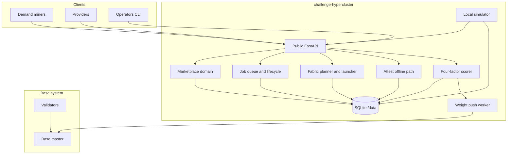

# Architecture

Hypercluster is a Python ≥ 3.12 Base challenge (`create_challenge_app`) with SQLite on `/data`, public signed marketplace and job APIs, topology-aware fabric planning, optional dstack TEE offline verification, and raw hotkey weight push to Base master.

Canonical package layout lives under `src/hypercluster/`. Upstream product home: [BaseIntelligence/hypercluster](https://github.com/BaseIntelligence/hypercluster).

## Coordination flow



## Components

| Component | Responsibility |
| --- | --- |
| **API layer** | Base `/health` `/ready` `/version`, public `/v1/*` routes, signed write auth, `get_weights` hook |
| **Marketplace** | Providers, nodes, offers, leases, pods; hard price/lifetime guards; home-grown (not a cloud adapter) |
| **Jobs** | Admit → place → provision/bind → run → collect → score → teardown; CAS-style queue claims |
| **Fabric** | FabricReport discovery, pack/spread placement, NCCL env matrix, multi-node launch contract, honesty injects in sim |
| **TEE attest** | Offline fixture verify, compose-hash golden path, tee_bonus only when verified and non-sim when claimed live |
| **Scoring** | `correctness × efficiency × fabric_gate × tee_bonus` → aggregation → raw weights |
| **Sim** | Inventory, launcher, TEE fixtures, mock master, scenario suite |
| **CLI** | Typer entry `hypercluster` wrapping the same domain paths |

## Trust boundaries

| Zone | Owns | Never sees |
| --- | --- | --- |
| Challenge container | Jobs, marketplace, scores, SQLite `/data`, planner | Master Postgres, docker socket, on-chain keys |
| Base master | Proxy, emission aggregation, challenge lifecycle | Job payloads, provider secrets used on hosts |
| Validators | Weight fetch + optional audit | Challenge DB, miner SSH material |
| Provider nodes | Job execution artifacts | Master credentials |

## Data model (high level)

Persistence is **async SQLite only** via `CHALLENGE_DATABASE_URL` (default `sqlite+aiosqlite:////data/challenge.sqlite3`). Never use `BASE_DATABASE_URL`. Never open master Postgres from the challenge.

Core entities: `providers`, `nodes`, `fabric_reports`, `offers`, `leases`, `pods`, `jobs`, `job_placements`, `job_attempts`, `job_proofs`, `scores`, `weight_snapshots`, `nonces`, `audit_events`.

## API surface (summary)

Built-in Base surfaces:

| Method | Path | Auth |
| --- | --- | --- |
| GET/HEAD | `/health` | none |
| GET/HEAD | `/ready` | none |
| GET/HEAD | `/version` | none |
| GET | `/internal/v1/get_weights` | challenge bearer |

Public product groups (mutating routes require signed miner headers: `X-Hotkey`, `X-Signature`, `X-Nonce`, `X-Timestamp`):

- **Marketplace:** providers, nodes, offers, rent, leases, pods
- **Jobs:** submit, list/status, cancel, attempts, fabric-report, results
- **Scoring:** leaderboard, scores by hotkey, weight-preview
- **Local sim hooks:** idle-reclaim, drain (dev/sim; not emission control)

Host proxy form under Base: `/challenges/hypercluster/...`. Relative paths above are challenge-root absolute.

## Jobs and marketplace handoff

```text
Provider registers node → fabric report → offer (price + max lifetime)
Renter rents offer → lease + pod
Renter submits HyperJob → admit → place (rankmap + NCCL env)
Worker / combined mode launches → collect metrics + optional proofs
Score → weight snapshot → push to master
Teardown lease policy on terminal or terminate
```

## Local vs product paths

| Path | Default CI | Product runtime |
| --- | --- | --- |
| Self inventory / SSH fleets | Simulated | Yes |
| Multi-node IB/NCCL | **Local sim required** | Real fabrics when operators supply them |
| TEE offline fixtures | Required | Enabled when proofs present |
| Live TEE hardware | Optional skip | Optional (`HYPER_TEE_LIVE`) |
| Commercial cloud rental | Forbidden in gated tests | Not a product dependency; optional external capacity behind a hotkey |

## Out of scope (product)

- First-party Verda / commercial broker SDK or OAuth client
- Challenge-side `set_weights` or chain UID mapping
- Full R=2 multi-node re-execution as default honesty
- Claiming InfiniBand encryption from GPU CC/TDX alone
- Multi-replica SQLite writers sharing one file without additional coordination

See also [Security](security.md), [Scoring](scoring.md), and [Fabric](fabric.md).
